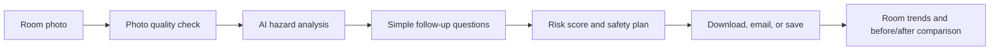

# AI SafeHome

AI SafeHome helps older adults, families, and caregivers spot possible fall hazards in a room. A person takes or uploads one room photo, answers only the follow-up questions the photo cannot answer, and receives a risk score plus a plain-language safety plan.

This is an educational home-safety tool. It does not diagnose medical conditions, calculate a person's medical fall risk, or guarantee fall prevention.

## What the app does

1. Choose a room and take or upload one photo.
2. AI looks for possible visible fall hazards.
3. The app asks short follow-up questions only when the photo is unclear.
4. The app gives a 0–100 risk score, a risk label, and a three-step safety plan.
5. A person can download, share, email, or save a check to compare it with a later room check.

## Built for older adults

- Large, mobile-friendly controls
- Light, dark, system, and high-contrast color modes
- Adjustable text size
- Optional Read Aloud buttons
- Plain-English questions and recommendations
- Visual markers showing the approximate place in the photo that matches each possible hazard

## Key features

- AI photo analysis for visible home fall hazards
- AI-generated follow-up questions in simple language
- A capped 0–100 risk score with a clear risk label
- A three-step safety plan with estimated score impact
- Before/after room comparisons for rechecks
- Room history, trends, and progress summaries
- Optional email sharing with up to five recipients
- Optional password-protected accounts for saving room checks

## How the score works

AI considers each possible hazard separately and assigns a severity score. If an AI score is unavailable, the app uses the established category value as a backup. Confirmed follow-up concerns and an AI uncertainty buffer for skipped follow-up questions may be added. The final score is always capped at 100.

A lower score means fewer possible fall hazards were identified. It is a guide for prioritizing room-safety improvements, not a medical prediction.

## Privacy and responsible AI

- Use room photos without faces, mail, addresses, medicine bottles, or medical documents.
- Photos are used during the current app session and are not saved to the app database.
- When real AI analysis is enabled, the uploaded image is sent to the configured AI provider for analysis.
- If a person chooses to save a check, the app stores the account email, Room Name, score, risk label, and check details needed for progress history. Passwords are stored as secure hashes, not as readable text.
- AI can miss hazards or misunderstand a photo. A person should review the room and seek qualified help for serious concerns.

See [DATA_POLICY.md](DATA_POLICY.md) for the full data description.

## Technical design



The app is built with Python and Streamlit. Pillow prepares upright photo previews and visual hazard markers. The optional AI analysis uses the OpenAI API. Optional saved-check and account features use Supabase; optional email sharing uses Brevo.

## Source layout

- `app.py` — page flow and the small application router
- `src/app_state.py` — session state, reset actions, and navigation
- `src/account_ui.py` — optional account, password-reset, and privacy controls
- `src/image_tools.py` — image validation and orientation handling
- `src/saved_checks.py` — optional saving and room-history updates
- `src/ai_analysis.py` and `src/scoring.py` — AI analysis and score calculation
- `src/ui.py` — shared accessible styling and display helpers
- `src/report_builder.py`, `src/trends.py`, and `src/comparison.py` — reports and progress views

The modules are intentionally separated by responsibility so a future editor can change one part of the app without searching through every page.

## Run locally

1. Create and activate a Python virtual environment.
2. Install dependencies:

   ```bash
   pip install -r requirements.txt
   ```

3. Add the required secrets to `.env` or Streamlit secrets. Do not commit those secrets.
4. Run the app:

   ```bash
   streamlit run app.py
   ```

The app can still show safe sample/fallback results if real AI analysis is unavailable. Saved checks and server-side email are optional and require their respective configuration.

## Project guide

- [TESTING.md](TESTING.md) — functional, accessibility, and mobile checks
- [FINAL_CHECKLIST.md](FINAL_CHECKLIST.md) — pre-submission checklist
- [DATA_POLICY.md](DATA_POLICY.md) — privacy and responsible-AI details
- [DEPLOYMENT_DATABASE_TEST.md](DEPLOYMENT_DATABASE_TEST.md) — saved-check deployment testing

## Congressional App Challenge submission notes

For a demonstration, use staged room photos only. Show one complete path: photo, AI findings, follow-up questions, risk score, three-step plan, and a before/after comparison. Be ready to explain the score cap, the uncertainty buffer, privacy limits, and why human review remains important.
